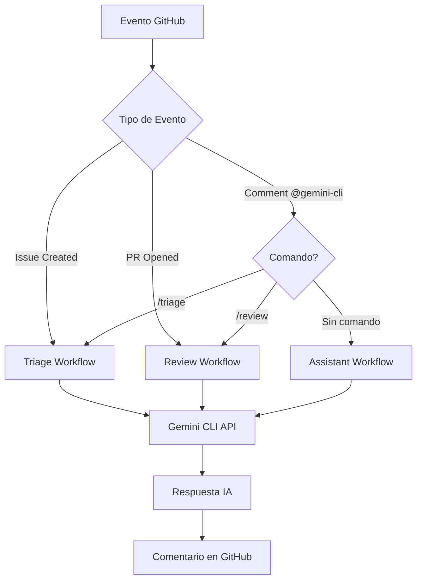

# 🔧 Guía Técnica - Workflows Gemini CLI

## 📋 Arquitectura General

### **🏗️ Estructura de Workflows**

```
.github/workflows/
├── gemini-issue-automated-triage.yml    # Clasificación de Issues/PRs
├── gemini-pr-review.yml                 # Revisión de código
└── gemini-assistant.yml                 # Asistente general
```

### **🔄 Flujo de Ejecución**



## 🛠️ Configuración Técnica

### **🔐 Variables de Entorno Requeridas**

```yaml
secrets:
  GEMINI_API_KEY: ${{ secrets.GEMINI_API_KEY }}
```

### **📦 Acciones Utilizadas**

| Acción | Versión | Propósito |
|--------|---------|-----------|
| `actions/checkout@v4` | v4 | Checkout del código |
| `actions/github-script@v7` | v7 | Scripts JavaScript en GitHub |
| `google-github-actions/run-gemini-cli@v0.1.10` | v0.1.10 | Integración con Gemini CLI |

### **🔒 Permisos Necesarios**

```yaml
permissions:
  contents: read          # Leer archivos del repositorio
  issues: write          # Comentar y etiquetar issues
  pull-requests: write   # Comentar en PRs
  id-token: write        # OIDC para autenticación (opcional)
  statuses: write        # Reportar status checks (PRs)
```

## 🧩 Análisis de Workflows

### **🏷️ 1. Workflow de Triage (`gemini-issue-automated-triage.yml`)**

#### **Triggers:**
```yaml
on:
  issues:
    types: [opened, edited, reopened]
  issue_comment:
    types: [created]
  pull_request_review_comment:  # NUEVO
    types: [created]
  workflow_dispatch:
```

#### **Lógica de Activación:**
```yaml
if: >-
  github.event_name == 'workflow_dispatch' ||
  (github.event_name == 'issues' && github.event.action == 'opened') ||
  (github.event_name == 'issue_comment' && 
   contains(github.event.comment.body, '@gemini-cli') && 
   contains(github.event.comment.body, '/triage')) ||
  (github.event_name == 'pull_request_review_comment' &&  # NUEVO
   contains(github.event.comment.body, '@gemini-cli') && 
   contains(github.event.comment.body, '/triage'))
```

#### **Funciones Principales:**
- ✅ **Detección automática** de nuevos issues
- 🏷️ **Clasificación inteligente** por categoría, prioridad y complejidad
- 👥 **Sugerencia de asignación** a miembros del equipo
- 🆕 **Triage de PRs** por complejidad y riesgo

### **🔍 2. Workflow de Review (`gemini-pr-review.yml`)**

#### **Triggers:**
```yaml
on:
  pull_request:
    types: [opened, reopened, synchronize]
  pull_request_review_comment:
    types: [created]
  issue_comment:
    types: [created]
  workflow_dispatch:
```

#### **Lógica de Activación:**
```yaml
if: >-
  github.event_name == 'pull_request' ||
  github.event_name == 'workflow_dispatch' ||
  (github.event_name == 'pull_request_review_comment' && 
   contains(github.event.comment.body, '@gemini-cli') && 
   contains(github.event.comment.body, '/review')) ||
  (github.event_name == 'issue_comment' && 
   github.event.issue.pull_request != null &&
   contains(github.event.comment.body, '@gemini-cli') && 
   contains(github.event.comment.body, '/review')) ||
  (github.event_name == 'issue_comment' &&  # NUEVO
   github.event.issue.pull_request == null &&
   contains(github.event.comment.body, '@gemini-cli') && 
   contains(github.event.comment.body, '/review'))
```

#### **Funciones Principales:**
- 🔍 **Revisión automática** de PRs
- 🔒 **Detección de vulnerabilidades** y problemas de seguridad
- ⚡ **Análisis de rendimiento** y optimizaciones
- 🆕 **Review de código en issues** cuando se comparte código

#### **Extracción de Diff:**
```javascript
// Script para obtener cambios del PR
const { data: files } = await github.rest.pulls.listFiles({
  owner: context.repo.owner,
  repo: context.repo.repo,
  pull_number: prNumber
});

// Limitar a 10 archivos para evitar prompts muy largos
for (const file of files.slice(0, 10)) {
  // Procesar patch y cambios
}
```

### **💬 3. Workflow Assistant (`gemini-assistant.yml`)**

#### **Triggers:**
```yaml
on:
  issue_comment:
    types: [created]
  pull_request_review_comment:
    types: [created]
  pull_request_review:
    types: [submitted]
  workflow_dispatch:
```

#### **Lógica de Exclusión:**
```yaml
if: >-
  github.event_name == 'workflow_dispatch' ||
  (github.event_name == 'issue_comment' && 
   contains(github.event.comment.body, '@gemini-cli') && 
   !contains(github.event.comment.body, '/triage') &&
   !contains(github.event.comment.body, '/review'))
```

#### **Funciones Principales:**
- 💭 **Respuestas a consultas generales** sobre código y arquitectura
- 📚 **Explicaciones técnicas** detalladas
- 💡 **Sugerencias específicas** del proyecto
- 🔍 **Análisis contextual** del repositorio

## 🎯 Prompts Optimizados

### **🏷️ Prompt de Triage:**
```
Eres un experto en gestión de proyectos de software y clasificación de issues.

Analiza el siguiente contenido y proporciona:
1. **Categoría Principal** (bug, feature, documentation, etc.)
2. **Prioridad** (low, medium, high, critical)
3. **Complejidad** (simple, moderate, complex)
4. **Área Técnica** (frontend, backend, database, etc.)
5. **Labels Sugeridos** (máximo 5)
6. **Comentario de Análisis** (resumen y próximos pasos)
```

### **🔍 Prompt de Review:**
```
Eres un revisor de código senior experto en buenas prácticas de desarrollo.

Analiza el siguiente diff y proporciona:
1. **Problemas de Seguridad** (si los hay)
2. **Optimizaciones de Rendimiento**
3. **Mejoras de Código Limpio**
4. **Bugs Potenciales**
5. **Cumplimiento de Estándares**
6. **Recomendaciones Específicas**
```

### **💬 Prompt de Assistant:**
```
Eres un asistente técnico experto que ayuda con consultas de desarrollo.

Contexto del repositorio: [INFORMACIÓN_DEL_REPO]
Pregunta del usuario: [PREGUNTA]

Proporciona una respuesta clara, práctica y específica para este proyecto.
```

## 🚀 Optimizaciones Implementadas

### **⚡ Rendimiento:**
- ✅ **Límite de archivos**: Máximo 10 archivos en diff para evitar timeouts
- ✅ **Tamaño de patch**: Máximo 2000 caracteres por archivo
- ✅ **Timeout configurado**: 15 minutos máximo por workflow
- ✅ **Caché de contexto**: Reutilización de información del repositorio

### **🔒 Seguridad:**
- ✅ **Permisos mínimos**: Solo los permisos estrictamente necesarios
- ✅ **Validación de entrada**: Verificación de comandos y parámetros
- ✅ **Secretos seguros**: API keys almacenadas como secrets de GitHub
- ✅ **Aislamiento**: Cada workflow ejecuta en contenedor separado

### **🛡️ Robustez:**
- ✅ **Manejo de errores**: Try-catch en scripts críticos
- ✅ **Validación de contexto**: Verificación de existencia de PRs/issues
- ✅ **Fallbacks**: Mensajes por defecto en caso de fallos
- ✅ **Logging detallado**: Información de debug en Actions

## 🔄 Flujo de Datos

### **📊 Procesamiento de Eventos:**

1. **Recepción**: GitHub webhook dispara el workflow
2. **Filtrado**: Condiciones `if` determinan ejecución
3. **Contexto**: Extracción de información del evento
4. **Procesamiento**: Llamada a Gemini CLI con prompt optimizado
5. **Respuesta**: Procesamiento de respuesta de IA
6. **Acción**: Comentario, etiquetas o reportes en GitHub

### **📈 Métricas y Monitoreo:**

```yaml
# En cada workflow se incluye logging para monitoreo
- name: Log Execution
  run: |
    echo "Workflow: ${{ github.workflow }}"
    echo "Event: ${{ github.event_name }}"
    echo "Timestamp: $(date)"
    echo "Repository: ${{ github.repository }}"
```

## 🔧 Personalización

### **🎨 Modificar Prompts:**
Los prompts están en cada workflow y pueden editarse según necesidades específicas.

### **⚙️ Ajustar Triggers:**
Modificar secciones `on:` y `if:` para cambiar cuándo se ejecutan los workflows.

### **🏷️ Personalizar Labels:**
Editar listas de labels en los scripts de GitHub Actions.

### **📊 Agregar Métricas:**
Integrar con herramientas de monitoreo mediante webhooks adicionales.

---

💡 **Consejo**: Para modificaciones avanzadas, revisa la [documentación oficial de Gemini CLI](https://github.com/google-github-actions/run-gemini-cli) y [GitHub Actions](https://docs.github.com/en/actions).
